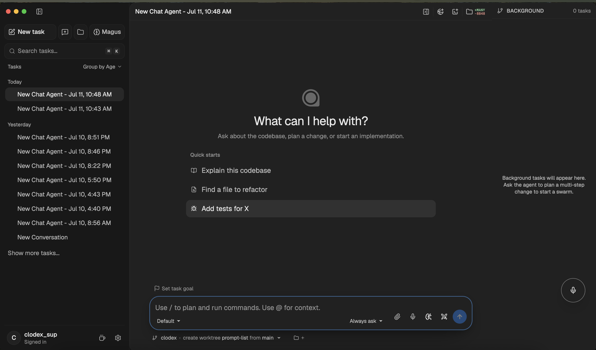
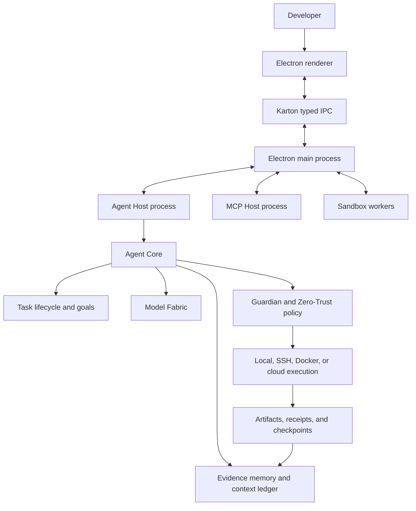

<picture>
  <source media="(prefers-color-scheme: dark)" srcset="./apps/website/public/clodex-logo-on-dark.png">
  
</picture>

# Clodex

### Local-first agentic IDE with governed execution

[](https://ide.clodex.xyz)

[](./LICENSE)


[](https://x.com/CLODEx_lab)

Clodex is an open-source agentic development environment that combines
persistent AI tasks, code, terminal, browser, Git, models, memory, and
controlled execution in one Electron workspace.

It is an early-stage, solo-led research and engineering project. The current
Technical Preview is intended to validate architecture and real workflows; it
is not presented as a production-mature IDE or an established community.

It is built around a simple principle:

> Model output is untrusted input. Authority comes from explicit policy,
> isolated runtimes, and user-controlled review.

**Current release status:** Technical Preview. The architectural core is
implemented and tested locally. Advanced execution lanes remain feature-gated
until their live promotion evidence and manual sign-off are complete.

## Start here

| Goal                                    | Document                                                                                      |
| --------------------------------------- | --------------------------------------------------------------------------------------------- |
| Understand the product in a few minutes | [Product overview](./short_doc.en.md) · [Русский обзор](./short_doc.md)                       |
| Run Clodex locally                      | [Developer handbook](./DEVELOPERS.md)                                                         |
| Study the complete system               | [Full project documentation](./full_doc.md)                                                   |
| Navigate the engineering documentation  | [Developer documentation index](./docs/developer/README.md)                                   |
| Review the architecture                 | [Architecture](./docs/developer/architecture.md)                                              |
| Review security and data handling       | [Security and data](./docs/developer/security-and-data.md) · [Security policy](./SECURITY.md) |
| Understand project lineage              | [Clodex and Stagewise upstream](./CLODEX_VS_UPSTREAM.md)                                     |
| Contribute or collaborate               | [Contributing](./CONTRIBUTING.md) · [Collaboration paths](./COLLABORATE.md)                   |
| Understand project governance           | [Governance](./GOVERNANCE.md) · [Code of conduct](./CODE_OF_CONDUCT.md)                      |
| Follow the independent-kernel migration | [Hybrid strangler plan](./docs/migration/README.md)                                           |
| Explore the live project                | [ide.clodex.xyz](https://ide.clodex.xyz)                                                      |

<p align="center">
  
</p>

## Project lineage

Clodex began as a modified version of the open-source Stagewise codebase and
has since diverged into an independently maintained project focused on
governed execution, evidence, policy enforcement, model routing, runner
isolation, and session continuity.

The exact upstream base commit, reproducible diff method, Clodex-specific
systems, and continuing upstream-derived areas are documented in
[`CLODEX_VS_UPSTREAM.md`](./CLODEX_VS_UPSTREAM.md). Upstream copyright and
license notices are preserved in
[`THIRD-PARTY-NOTICES.md`](./THIRD-PARTY-NOTICES.md). Clodex is not affiliated
with or endorsed by Stagewise.

## Why Clodex

A conventional coding assistant produces the next answer or patch. Clodex
models engineering work as a durable task with its own state, workspaces,
processes, permissions, evidence, and review lifecycle.

A task can:

1. retain context across long-running work and application restarts;
2. operate across files, Git, terminals, browser tabs, MCP tools, and runners;
3. route work between models without changing the surrounding workflow;
4. request approval before high-impact shell, network, browser, or remote
   actions;
5. execute locally or move to Docker, SSH, or cloud-backed environments;
6. return diffs, receipts, artifacts, and a self-contained final result.

## Core capabilities

| Area                       | What Clodex provides                                                                                                         |
| -------------------------- | ---------------------------------------------------------------------------------------------------------------------------- |
| **Persistent tasks**       | Searchable task history, projects, workspaces, forks, goals, progress, token budgets, and time budgets.                      |
| **Agent runtime**          | Managed turns, cancellation, recovery, collaboration modes, tool execution, and supervised lifecycle handling.               |
| **Code workspace**         | File editing, pending edits, line-level diffs, Git operations, worktrees, pull-request review, and protected merge flows.    |
| **Terminal and browser**   | Persistent shell sessions, local ports, browser/CDP context, console output, screenshots, and visual verification.           |
| **Evidence-backed memory** | Scoped memory, append-only evidence records, retrieval, provenance, checkpoints, and bounded context injection.              |
| **Model Fabric**           | Provider-neutral model routing, endpoint health, fallbacks, budget controls, usage accounting, and policy publication.       |
| **Execution Fabric**       | Local execution, SSH sessions, Docker runners, custom runner contracts, cloud-task foundations, and portable snapshots.      |
| **Guardian**               | Independent authorization decisions for sensitive capabilities, fail-closed outcomes, approval escalation, and audit events. |
| **Network Policy**         | Destination grants, DNS validation, controlled browser access, MCP egress enforcement, and an audit ledger.                  |
| **Extensions**             | MCP servers, skills, signed plugins, private marketplaces, runner SDKs, and capability-bounded generated apps.               |
| **Continuity**             | Session checkpoints, crash recovery, memory synchronization, artifact capture, and experimental session teleportation.       |

## Architecture

Clodex separates user interface, agent execution, tools, secrets, and policy
into explicit process and trust boundaries.



### Important packages

```text
apps/browser/                 Electron desktop application
apps/website/                 Public project website
agent/runtime-node/           Isolated Node.js agent runtime
packages/agent-core/          Agent lifecycle, memory, routing, and policy
packages/agent-shell/         Shell and execution contracts
packages/clodex-contracts/    Shell-independent Stage 0 kernel contracts
packages/mcp-runtime/         MCP transport and protocol runtime
packages/runner-sdk/          External runner integration SDK
packages/karton/              Typed state and RPC transport
packages/stage-ui/            Shared interface components
```

For a complete map, see
[`docs/developer/repository-map.md`](./docs/developer/repository-map.md).

## Security model

Clodex does not rely on a prompt asking the model to behave safely. Sensitive
operations pass through deterministic controls outside the model runtime.

- **Fail closed:** ambiguous or invalid authorization results do not execute.
- **Isolated hosts:** agent turns, MCP servers, and sandboxed workloads run
  outside the renderer.
- **Explicit capabilities:** possessing a tool does not automatically grant
  authority to use it.
- **Controlled egress:** network destinations are evaluated independently of
  model intent.
- **Protected storage:** credentials use OS-backed storage; sensitive task
  artifacts use context-bound authenticated encryption.
- **Human review:** pending edits, permission prompts, protected merge flows,
  and high-impact approvals keep final authority with the user.
- **Supply-chain checks:** extension identity, signatures, integrity,
  compatibility, rollback, and quarantine are verified before activation.
- **Privacy-aware audit:** operational events avoid storing prompts, source
  code, audio, credentials, or other unnecessary sensitive content.

Read the detailed model in
[`docs/developer/security-and-data.md`](./docs/developer/security-and-data.md).
Report vulnerabilities through [`SECURITY.md`](./SECURITY.md), not through a
public issue.

## Capability status

| Capability                                           | Status                          |
| ---------------------------------------------------- | ------------------------------- |
| Desktop workspace, files, Git, terminal, and browser | **Available for local testing** |
| Task lifecycle, goals, scoped memory, and recovery   | **Available for local testing** |
| MCP runtime and isolated Agent Host                  | **Available for local testing** |
| Local and SSH execution                              | **Available for local testing** |
| Docker and external runner control plane             | **Preview**                     |
| Guardian and managed network egress                  | **Preview**                     |
| Signed extensions and generated apps                 | **Preview**                     |
| Cloud Tasks and Session Teleport                     | **Labs / promotion-gated**      |
| Stable cross-platform distribution                   | **Pending promotion evidence**  |

The status labels are deliberate: implemented foundations are not presented as
stable production capabilities until real installation evidence, monitoring,
rollback, and manual promotion checks are complete.

## Run from source

### Requirements

- Node.js `22.23.1`
- pnpm `10.30.3`
- Git
- macOS, Linux, or Windows for development
- macOS for DMG packaging and notarization

### Setup

```bash
git clone https://github.com/mereyabdenbekuly-ctrl/clodex-ide.git
cd clodex-ide

corepack enable
corepack prepare pnpm@10.30.3 --activate

cp .env.example .env
cp .env.example .env.dev

pnpm install --frozen-lockfile
pnpm build:packages
pnpm --dir apps/browser start:fast
```

Use the checked development command when you want type checking to run in
parallel with Electron:

```bash
pnpm --dir apps/browser start
```

Environment and provider configuration are documented in
[`docs/developer/local-development.md`](./docs/developer/local-development.md).
Never commit `.env`, credentials, signing keys, or local runtime state.

## Validation

Run the complete local validation suite before opening a pull request:

```bash
pnpm check
pnpm typecheck
pnpm test
pnpm security:secrets
```

Validated baseline on **July 12, 2026**:

| Gate                     |           Result |
| ------------------------ | ---------------: |
| Package builds           |          `7 / 7` |
| Typecheck tasks          |        `14 / 14` |
| Test tasks               |        `16 / 16` |
| Automated tests          |   `3,322 passed` |
| Working-tree secret scan |     `0 findings` |
| Website production build |         `passed` |
| Desktop startup smoke    |         `passed` |
| Main-plan readiness      |     `ready=true` |
| Stable promotion         | `evidence-gated` |

CI and signed release evidence remain the source of truth for a published
artifact. See
[`docs/developer/testing-and-release.md`](./docs/developer/testing-and-release.md)
and [`VERSIONING.md`](./VERSIONING.md).

## Extending Clodex

Clodex exposes several integration surfaces:

- **MCP:** connect local stdio or remote Streamable HTTP/SSE servers;
- **Skills:** package reusable agent instructions and workflows;
- **Plugins:** distribute signed capabilities and optional executable runtimes;
- **Runner SDK:** integrate Docker, SSH, cluster, or custom execution backends;
- **Generated Apps:** create task-owned interactive tools with explicit grants;
- **Automations:** schedule bounded tasks with declared capabilities.

Start with
[`docs/developer/extensions-and-integrations.md`](./docs/developer/extensions-and-integrations.md).

## Contributing

Contributions should be scoped, testable, and reviewable.

1. Read [`CONTRIBUTING.md`](./CONTRIBUTING.md).
2. Follow the commit and versioning rules in [`VERSIONING.md`](./VERSIONING.md).
3. Sign commits according to the repository [`DCO`](./DCO).
4. Run formatting, type checking, tests, and secret scanning.
5. Include focused tests for changed behavior.

Use the repository issue templates for bugs, feature proposals, documentation,
installation and provider problems, security questions, and independent tester
reports. Use GitHub Discussions for design questions and community proposals.

The contributor trust ladder, maintainer responsibilities, and access policy
are defined in [`GOVERNANCE.md`](./GOVERNANCE.md). Scoped compute grants and
longer-term collaboration paths are described in
[`COLLABORATE.md`](./COLLABORATE.md).

## Maintainers and community

Clodex is currently maintained independently by
[Merey Abdenbekuly](https://github.com/mereyabdenbekuly-ctrl) and welcomes
external contributors, testers, security reviewers, research collaborators,
and integration partners. Current roles and upstream credits are listed in
[`CONTRIBUTORS.md`](./CONTRIBUTORS.md).

Follow project updates on [X · @CLODEx_lab](https://x.com/CLODEx_lab).

## Support independent development

If Clodex is useful to you, the current support options and their terms are
listed on the [Clodex website](https://ide.clodex.xyz/#support). Financial
support does not buy roadmap priority, repository access, or merge decisions.

## License

Clodex is distributed under the
[GNU Affero General Public License v3.0](./LICENSE).
Third-party components and notices are listed in
[`THIRD-PARTY-NOTICES.md`](./THIRD-PARTY-NOTICES.md).
