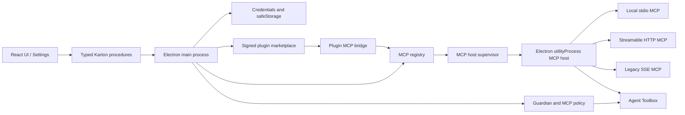
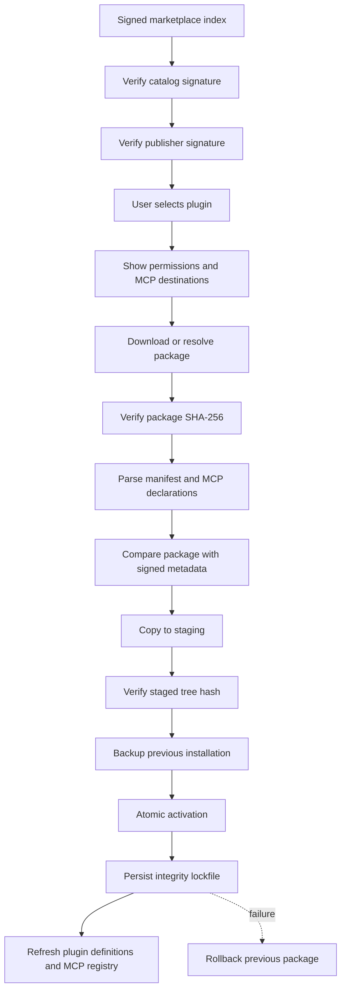

# Полный бриф разработки MCP Runtime, Protected Files, Desktop Automation и MCP Ecosystem

**Проект:** Clodex IDE
**Репозиторий:** `/Users/admin/Documents/ide/stagewise`
**Состояние:** 11 июля 2026 года
**Статус утверждённого roadmap:** P0–P3 завершены

---

## 1. Назначение документа

Этот документ фиксирует полный результат разработки, выполненной в рамках
данного рабочего чата:

- проверенные архитектурные требования desktop-agent runtime
  приложений;
- решения, которые были приняты для Clodex;
- утверждённую последовательность P0–P3;
- фактически реализованные подсистемы;
- security boundaries и запрещённые сокращения;
- основные контракты, сервисы и точки интеграции;
- результаты тестирования;
- текущее состояние проекта;
- задачи release-hardening, не входившие в утверждённый roadmap.

Канонический утверждённый план:

- `docs/general-mcp-runtime-plan.md`

Основные threat models:

- `docs/general-mcp-runtime-threat-model.md`
- `docs/protected-files-threat-model.md`
- `docs/desktop-automation-macos-threat-model.md`
- `docs/mcp-ecosystem-threat-model.md`

Этот бриф не заменяет перечисленные документы. Он объединяет их в одну
архитектурную и продуктовую картину.

---

## 2. Исходная задача и архитектурный референс

Работа началась с анализа архитектуры современного Electron desktop-agent
приложения. Наиболее ценные обнаруженные паттерны:

1. Изолированный MCP host на Node.js.
2. Локальные MCP servers через stdio и дочерние процессы.
3. Remote MCP через Streamable HTTP и legacy SSE.
4. Передача сообщений через узкий typed transport.
5. Electron `safeStorage` для локальных secrets.
6. Skills как автономные директории или архивы с `SKILL.md`.
7. Нативные screenshot/accessibility bridges.
8. AppleScript как ограниченный macOS fallback.
9. Publisher/catalog signing для plugin distribution.

Эти находки использовались только как архитектурный референс.

### Что было запрещено переносить

С самого начала зафиксировано:

- не использовать чужие OAuth client IDs;
- не использовать чужие Sentry/telemetry DSN;
- не зависеть от внутренних API или proxy endpoints другого продукта;
- не копировать извлечённые Swift/Rust/native binaries;
- не распространять чужой bundled content;
- не импортировать raw OAuth/session tokens;
- не считать MCP annotations доверенной policy;
- не делать user-installed plugins или skills безусловно доверенными.

Clodex реализует собственные trust boundaries, protocol contracts,
credentials, telemetry и runtime lifecycle.

---

## 3. Итоговая последовательность

Порядок был утверждён как неизменяемый:

1. **P0 — General MCP Runtime**
2. **P1 — Protected Files**
3. **P2 — Desktop Automation macOS Preview**
4. **P3 — MCP Ecosystem**

Внутренний порядок P3:

1. P3.1 — Remote MCP OAuth
2. P3.2 — Resources and Prompts
3. P3.3 — List-changed Notifications
4. P3.4 — Form-mode Elicitation
5. P3.5 — Official Catalog
6. P3.6 — Publisher Signing
7. P3.7 — Private Marketplace

Новый этап начинался только после focused tests, regression и typecheck
предыдущего этапа.

---

## 4. Итоговая архитектура



### Основной trust boundary

- Renderer не имеет прямого доступа к secrets или process spawning.
- Electron main валидирует конфигурацию, credentials, policy и provenance.
- MCP host работает в отдельном `utilityProcess`.
- Utility process является failure boundary, но не объявляется полноценной
  OS sandbox.
- Local stdio MCP явно считается пользовательским кодом с правами текущего OS
  user.
- Все потенциально опасные agent tool calls проходят policy и approval.

---

# P0 — General MCP Runtime

## 5. Цель P0

Преобразовать single-gateway MCP integration в общую платформу, способную
обслуживать:

- встроенный Clodex Gateway;
- пользовательские stdio servers;
- Streamable HTTP servers;
- legacy SSE servers;
- MCP servers из signed plugins;
- безопасный импорт совместимых desktop MCP configurations.

## 6. Реализованный runtime package

Основной package:

- `packages/mcp-runtime/`

В нём зафиксированы:

- versioned Zod schemas;
- transport union:
  - `stdio`;
  - `streamable-http`;
  - `sse`;
- source/trust metadata;
- credential references;
- per-server и per-tool policy;
- protocol messages main ↔ utility host;
- bounded resources, prompts и elicitation contracts;
- lifecycle и error serialization.

### Изолированный MCP host

Основные зоны:

- `apps/browser/src/backend/mcp-host/`
- `apps/browser/src/backend/mcp-host/host.ts`
- `apps/browser/src/backend/mcp-host/supervisor.ts`

Реализовано:

- запуск через Electron `utilityProcess`;
- typed initialize/connect/list/call/close/shutdown;
- heartbeat;
- request timeout;
- cancellation;
- controlled restart;
- bounded logs;
- sanitized serialized errors;
- redaction secret values;
- `shell: false`;
- явный `cwd`;
- sanitized environment;
- восстановление desired registry state после host restart.

### Transport behavior

#### Stdio

- command и args проходят schema validation;
- shell expansion отключён;
- environment собирается явно;
- raw secrets разрешаются только в main process;
- stdout/stderr ограничиваются;
- зависший server не блокирует Electron main.

#### Streamable HTTP и SSE

- HTTPS обязателен, кроме explicitly allowed loopback cases;
- redirects блокируются;
- headers формируются из literal values и credential references;
- credentials имеют origin binding;
- timeout и output caps применяются независимо от SDK defaults.

## 7. Registry и persistence

Основные зоны:

- `apps/browser/src/backend/services/mcp/index.ts`
- `apps/browser/src/backend/services/mcp/settings.ts`
- `apps/browser/src/shared/mcp-settings.ts`

Registry содержит:

- stable server ID;
- display name;
- source;
- trust tier;
- transport configuration;
- policy;
- desired enabled state;
- runtime status;
- restart count;
- sanitized diagnostics;
- catalog revision.

Lifecycle:

- disabled;
- disconnected;
- connecting;
- authorization-required;
- connected;
- degraded;
- failed.

Пользовательская MCP configuration сохраняется encrypted. Raw secret values
не записываются в registry JSON.

## 8. Credentials

Основные правила:

- renderer работает с credential IDs, а не secret values;
- credential references разрешаются только в Electron main;
- remote headers ограничиваются allowed origins;
- local stdio получает только явно выбранные secrets;
- secret values добавляются в runtime redaction set;
- tokens запрещены в logs, telemetry, Karton state и persisted MCP config.

## 9. Policy и Toolbox integration

Реализовано:

- stable tool namespace;
- explicit deny имеет наивысший приоритет;
- irreversible/destructive tools требуют human approval;
- custom MCP default policy — `ask`;
- `readOnlyHint` используется только как сигнал;
- malicious annotation не может поднять policy до auto-allow;
- timeout и output caps применяются ко всем transports;
- Guardian вызывается до опасного действия.

## 10. Plugin MCP bridge

Основной файл:

- `apps/browser/src/backend/services/mcp/plugin-bridge.ts`

Поддерживается:

- `mcp/servers.json` внутри plugin package;
- permission `mcp` имеет реальный runtime effect;
- `network` и `credentials` проверяются отдельно;
- plugin MCP servers синхронизируются с registry;
- uninstall/update отключает связанные servers;
- tampered/quarantined package не регистрирует MCP;
- plugin MCP policy нормализуется максимум до `ask`;
- servers после install остаются disabled.

## 11. Safe import

Реализован preview-first import совместимой MCP configuration:

- нет live coupling к чужому config-файлу;
- command, args, cwd и environment показываются до подтверждения;
- raw secrets преобразуются в credential mapping;
- OAuth/session tokens не импортируются;
- malformed, traversal и unsupported records отклоняются;
- import применяется только к выбранным пользователем servers.

## 12. Settings UI

Основная зона:

- `apps/browser/src/ui/screens/settings/sections/mcp-settings-section.tsx`

Реализованы группы:

- Clodex Cloud;
- Local & Custom;
- Installed Plugins.

UI поддерживает:

- add/edit/disable/remove;
- connection test;
- source, trust и runtime status;
- transport preview;
- tools и effective policy;
- resources;
- resource templates;
- prompts;
- OAuth status;
- restart/refresh;
- bounded logs;
- custom credential creation.

## 13. Проверка P0

Финальный snapshot этапа:

- stdio, Streamable HTTP и SSE fixtures прошли;
- utility-process crash/restart smoke прошёл;
- timeout/cancel/restart покрыты;
- redaction и secret boundaries покрыты;
- Clodex Gateway regression сохранён;
- все 5 browser TypeScript targets прошли;
- browser suite: **118 файлов / 1152 теста**.

---

# P1 — Protected Files

## 14. Цель P1

Исключить хранение чувствительных agent artifacts в plaintext и сформировать
единый protected-file boundary для:

- attachments;
- Chronicle;
- shell logs;
- memory;
- diff-history blobs;
- caches;
- agent titles;
- protected mounts.

## 15. Формат protected files

Реализовано:

- versioned chunked format;
- per-file DEK;
- AES-256-GCM;
- уникальный nonce на каждый chunk;
- context-bound AAD;
- sequence и length authentication;
- authenticated final record;
- streaming read;
- fail-closed decryption.

Durable write:

1. staging file;
2. file fsync;
3. atomic rename;
4. directory fsync.

Migration выполняется one-way без plaintext staging copy.

## 16. Startup migration order

Зафиксирован порядок:

1. attachments;
2. Chronicle artifacts;
3. shell logs;
4. memory files;
5. diff-history blobs;
6. image/file caches;
7. encrypted titles.

Порядок защищён runtime guard и тестами.

## 17. Подсистемы P1

Основные зоны:

- `packages/agent-core/src/host/data-protection.ts`
- `packages/agent-core/src/host/protected-files.ts`
- `packages/agent-core/src/host/protected-mounts.ts`
- `apps/browser/src/backend/services/data-protection/`
- `apps/browser/src/backend/services/protected-files/`

Реализовано:

- protected attachments;
- protected Chronicle segments;
- append-only protected shell-log segments;
- durable shell teardown с ожиданием log drain;
- memory encryption;
- diff-history plaintext OID verification на каждом чтении;
- encrypted SQLite payloads для caches;
- WAL checkpoint/VACUUM handling;
- randomized encryption agent titles;
- decrypt/filter title search в trusted host memory;
- trusted read/glob/grep boundary для protected mounts.

### Изоляция физических путей

- `att`, `shells`, `memory` исключены из sandbox cwd;
- physical ciphertext paths не попадают в system/environment prompts;
- agent работает с логическими mount identifiers;
- decrypted content появляется только внутри trusted host operation.

## 18. Проверка P1

Финальный snapshot:

- `@clodex/agent-core`: **54 файла / 661 тест**;
- `@clodex/agent-shell`: **7 файлов / 149 тестов**;
- focused browser: **4 файла / 12 тестов**;
- browser regression: **129 файлов / 1226 тестов**;
- agent-core, agent-shell и все 5 browser TypeScript targets прошли.

---

# P2 — Desktop Automation macOS Preview

## 19. Цель P2

Добавить macOS desktop automation без переноса чужих native binaries и без
замены browser/CDP automation.

Browser/CDP остаётся предпочтительным path. Desktop automation используется
только когда browser-level control недостаточен.

## 20. Реализованный provider

Основные зоны:

- `apps/browser/src/backend/services/agent-os/`
- `apps/browser/src/backend/services/toolbox/tools/desktop-automation/`
- `apps/browser/src/shared/desktop-automation.ts`
- `apps/browser/src/ui/screens/main/_components/desktop-automation-*`

Реализовано:

- feature gate;
- macOS-only availability;
- Screen Recording onboarding;
- Accessibility onboarding;
- frontmost-window capture;
- AX inspection;
- bounded press actions;
- app allowlist;
- persistent visual indicator;
- global kill switch;
- one-shot opaque targets;
- approval UI;
- content-free audit.

## 21. Security boundary P2

- feature gate выключен по умолчанию;
- provider не стартует без Screen Recording и Accessibility;
- kill switch должен зарегистрироваться до session enable;
- session и approvals не сохраняются;
- capture требует единственного точного frontmost-window match;
- screenshots сохраняются как P1 protected attachments;
- inspect возвращает bounded allowlist AX roles;
- secure/password fields запрещены;
- press повторно проверяет app, window, role, title и enabled state;
- target одноразовый;
- permission revocation немедленно отменяет pending/in-flight work;
- system и irreversible actions требуют approval;
- audit не содержит screenshot, window title, labels или typed content.

## 22. AppleScript fallback

AppleScript реализован только как узкий статический fallback:

- scripts заранее определены;
- arbitrary script injection запрещён;
- output не попадает в telemetry;
- execution имеет timeout;
- static sources компилируются через `/usr/bin/osacompile`;
- чужие Swift/Rust bindings не используются.

Packaging metadata включает необходимые macOS usage descriptions и Apple
Events entitlement.

## 23. Проверка P2

Финальный snapshot:

- focused browser: **5 файлов / 47 тестов**;
- browser regression: **132 файла / 1254 теста**;
- agent-core, agent-shell и все 5 browser TypeScript targets прошли;
- 3 AppleScript sources скомпилированы без исполнения;
- entitlements plist прошёл `plutil -lint`.

---

# P3 — MCP Ecosystem

## 24. P3.1 — Remote OAuth

Основные зоны:

- `apps/browser/src/backend/services/mcp/oauth.ts`
- `apps/browser/src/backend/mcp-host/network.ts`
- `apps/browser/src/backend/services/mcp/index.ts`

Реализован собственный OAuth flow:

- RFC 7591 dynamic client registration;
- PKCE S256;
- CSPRNG state;
- one-time callback;
- callback TTL;
- exact custom-scheme callback route;
- encrypted OAuth session store;
- token refresh;
- token invalidation;
- authorization-required runtime state.

### OAuth trust boundary

- registry содержит только registration metadata;
- tokens, verifier и state хранятся отдельно encrypted;
- callback привязан к одному server ID;
- state потребляется до token exchange;
- повторный callback отклоняется;
- OAuth origins проверяются;
- redirects блокируются;
- custom MCP headers не пересылаются на другой OAuth origin;
- access/refresh/ID tokens и client secret добавляются в redaction set.

Чужие OAuth client IDs не используются.

## 25. P3.2 — Resources and Prompts

Поддержаны:

- resources/list;
- resources/read;
- resource templates;
- prompts/list;
- prompts/get;
- typed Settings contracts;
- agent toolbox access.

Ограничения:

- максимум 5000 items;
- максимум 100 pages;
- repeated cursor rejection;
- resource read и prompt get ограничены 4 MiB;
- content не сохраняется в Settings state;
- prompt arguments передаются только выбранному server;
- user/imported MCP context требует approval;
- builtin/signed plugin не получает redundant approval.

## 26. P3.3 — List-changed

Реализованы notifications:

- tools;
- resources;
- prompts.

Host принимает notification только при объявленной capability.

SDK auto-refresh не используется как trust boundary. Host самостоятельно
повторно читает bounded full catalog.

Resource change также инвалидирует resource-template cache.

Ошибка refresh не уничтожает последний валидный catalog.

## 27. Проверка P3.1–P3.3

- MCP runtime: **4 файла / 22 теста**;
- focused browser MCP: **5 файлов / 33 теста**;
- browser regression: **136 файлов / 1287 тестов**;
- все 5 browser TypeScript targets;
- real host smoke для OAuth, resources/prompts, list-changed, cancel, timeout,
  redaction и restart.

---

## 28. P3.4 — Form-mode Elicitation

Основные зоны:

- `packages/mcp-runtime/src/protocol.ts`
- `apps/browser/src/backend/mcp-host/host.ts`
- `apps/browser/src/backend/mcp-host/supervisor.ts`
- `apps/browser/src/backend/services/toolbox/tools/user-interaction/mcp-elicitation.ts`
- `apps/browser/scripts/mcp-host-smoke.ts`

Реализовано:

- capability рекламирует только `elicitation.form`;
- URL-mode всегда получает `cancel`;
- elicitation разрешена только во время agent-originated tool call;
- внутренний `agentInstanceId` не раскрывается MCP server;
- agentless request закрывается fail-closed;
- multi-agent ownership ambiguity закрывается fail-closed;
- UI показывает destination MCP server;
- server-provided text проходит escaping;
- максимум 10 fields;
- максимум 50 options на field;
- bounded labels/descriptions/values;
- required/default/min/max/duplicate invariants;
- select values ограничены server schema;
- accept/decline/cancel mapping;
- tool abort закрывает pending form;
- pending data не сохраняется и не телеметрируется.

Проверка:

- MCP runtime: **4 файла / 26 тестов**;
- focused browser: **5 файлов / 34 теста**;
- browser regression: **142 файла / 1309 тестов**;
- real utility-process smoke.

---

## 29. P3.5 — Official Catalog

Основные зоны:

- `apps/browser/src/shared/plugin-marketplace.ts`
- `apps/browser/src/backend/services/plugin-marketplace/index.ts`
- `apps/browser/src/backend/services/plugin-marketplace/trusted-keys.ts`
- `apps/browser/src/backend/services/mcp/plugin-bridge.ts`
- `apps/browser/src/ui/screens/settings/sections/plugins-section.tsx`
- `apps/browser/bundled/marketplace/`

Реализовано:

- Ed25519-signed official index;
- встроенный trusted public key;
- expiration и schema validation;
- duplicate plugin ID rejection;
- signed manifest;
- compatibility constraints;
- permission disclosure;
- package SHA-256;
- staged activation;
- atomic lockfile update;
- rollback;
- startup integrity reconciliation;
- quarantine tampered/orphaned packages.

### MCP disclosure

Signed manifest содержит:

- MCP server ID;
- display name;
- transport;
- endpoint;
- authentication mode.

Package `mcp/servers.json` повторно парсится при install и startup.

Фактические declarations должны совпасть с signed summary. Скрытый endpoint,
stdio declaration или undeclared MCP content отклоняются.

Перед install UI показывает:

- MCP destinations;
- origins;
- transport;
- authentication mode.

После install MCP servers остаются disabled.

Проверка:

- focused marketplace/MCP: **2 файла / 14 тестов**;
- browser regression: **142 файла / 1311 тестов**;
- все 5 TypeScript targets.

---

## 30. P3.6 — Publisher Signing

Основные зоны:

- `apps/browser/src/backend/services/plugin-marketplace/publisher-signing.ts`
- `apps/browser/src/backend/services/plugin-marketplace/verification.ts`
- `apps/browser/scripts/sign-plugin-publisher-attestation.ts`

Catalog signature и publisher signature разделены.

Publisher подписывает canonical attestation:

- manifest;
- package source;
- SHA-256.

Реализовано:

- stable `publisherId`;
- publisher name binding;
- publisher key registry внутри Clodex-signed index;
- active/revoked key status;
- duplicate key ID rejection;
- missing key rejection;
- invalid signature rejection;
- revoked key fail-closed;
- publisher key ID и signature в integrity lockfile;
- UI distinction:
  - Publisher signed;
  - Catalog signed.

### Signing CLI

CLI:

- принимает отдельный private-key file;
- запрещает symlink;
- требует regular file;
- на POSIX запрещает group/other permissions;
- не логирует private key или package content;
- проверяет созданную signature соответствующим public key.

Проверка:

- focused publisher/marketplace/MCP: **3 файла / 17 тестов**;
- combined regression: **4 файла / 24 теста**;
- browser regression: **147 файлов / 1335 тестов**;
- все 5 TypeScript targets;
- real Ed25519 CLI smoke.

---

## 31. P3.7 — Private Marketplace

Основные зоны:

- `apps/browser/src/backend/services/plugin-marketplace/private-sources.ts`
- `apps/browser/src/backend/services/plugin-marketplace/index.ts`
- `apps/browser/src/backend/services/plugin-marketplace/verification.ts`
- `apps/browser/src/shared/plugin-marketplace.ts`
- `apps/browser/src/shared/karton-contracts/ui/index.ts`
- `apps/browser/src/ui/screens/settings/sections/plugins-section.tsx`

### Encrypted source registry

Private source содержит:

- stable source ID;
- display name;
- HTTPS index URL;
- pinned signing key ID;
- pinned Ed25519 PEM public key;
- enabled state;
- created/updated timestamps.

Persistence:

- strict Electron `safeStorage`;
- plaintext fallback запрещён;
- TOFU запрещён;
- максимум 20 sources;
- duplicate IDs и normalized URLs запрещены.

Karton state не возвращает сохранённый PEM. Renderer получает:

- source metadata;
- key ID;
- SHA-256 SPKI fingerprint;
- verification status;
- generated/expires/refreshed timestamps;
- catalog;
- sanitized error.

### Pinned index fetch

Ограничения:

- только HTTPS;
- URL без username/password;
- URL без query;
- URL без fragment;
- `redirect: error`;
- timeout 20 секунд;
- 4 MiB `Content-Length` cap;
- 4 MiB фактически прочитанных decompressed bytes;
- canonical base64 envelope;
- exact pinned key ID;
- exact decoded payload-byte Ed25519 verification.

Fail-closed conditions:

- invalid PEM;
- non-Ed25519 key;
- key ID mismatch;
- invalid signature;
- malformed base64;
- schema mismatch;
- expired index;
- expiration до generation;
- duplicate plugin IDs;
- non-HTTPS package source;
- invalid/revoked publisher signature.

Verified private index хранится только в памяти. После restart source нужно
проверить повторно.

### Source-scoped provenance

Integrity lockfile сохраняет:

- `sourceId`;
- pinned `signingKeyId`;
- SHA-256 SPKI fingerprint.

Защита:

- official plugin не может незаметно заменить private plugin с тем же ID;
- другой private source не может заменить установленный plugin;
- update разрешён только из исходного source;
- uninstall требует совпадения source provenance;
- source нельзя удалить при установленных из него plugins;
- URL или signing key нельзя изменить при установленных plugins;
- trust root нельзя перепривязать к существующему lockfile entry.

### Settings UI

Добавлено:

- add private source;
- explicit PEM pin input;
- enable/disable;
- verify/refresh;
- remove;
- source status;
- key ID и fingerprint;
- source expiration;
- catalog review;
- install/update/uninstall;
- publisher signing badge;
- compatibility и source-collision errors;
- MCP destination/auth confirmation.

Private marketplace authentication в первом безопасном срезе намеренно не
поддерживается. Tokens и bearer credentials запрещены в source URL/config.

Проверка:

- focused private/marketplace/MCP: **4 файла / 30 тестов**;
- browser regression: **154 файла / 1365 тестов**;
- все 5 browser TypeScript targets;
- scoped `git diff --check`.

---

## 32. Marketplace install pipeline



Общие свойства official и private pipelines:

- compatibility check;
- permission check;
- MCP summary comparison;
- package hash;
- staged activation;
- rollback;
- startup quarantine;
- publisher provenance;
- MCP disabled by default.

---

## 33. Основные security invariants

### Secrets

- raw secrets не находятся в MCP registry;
- raw secrets не возвращаются в Karton state;
- tokens не попадают в logs/telemetry;
- credentials разрешаются в main process;
- remote credentials имеют origin binding;
- private marketplace URL не может содержать token.

### Process boundary

- local MCP запускается без shell;
- utility-process failure не падает вместе с main;
- requests имеют timeout и cancellation;
- host restart controlled;
- logs bounded и redacted.

### Human control

- irreversible/destructive MCP tools требуют approval;
- custom MCP default — ask;
- elicitation отправляется только после explicit submit;
- desktop system actions требуют one-time approval;
- private MCP destinations показываются до install.

### Supply chain

- official catalog имеет Clodex trust root;
- publisher signing является отдельным trust layer;
- private source использует explicit pin;
- TOFU отсутствует;
- package и extracted tree проверяются;
- source provenance сохраняется;
- cross-source overwrite запрещён.

### Persistence

- MCP registry encrypted;
- OAuth sessions encrypted;
- private marketplace sources encrypted;
- protected artifacts используют P1 chunked AEAD;
- integrity lockfile не содержит raw secrets.

---

## 34. Что было сознательно отклонено

В процессе разработки не были приняты следующие shortcuts:

- копирование чужого `nodeHost.js` без адаптации к Clodex contracts;
- запуск MCP прямо в renderer или Electron main;
- хранение raw env/header secrets в JSON;
- auto-trust на основании `readOnlyHint`;
- импорт чужих OAuth client registrations;
- использование чужого MCP proxy;
- использование чужого telemetry DSN;
- перенос нативных screenshot/accessibility binaries;
- URL-mode elicitation без отдельного navigation security flow;
- automatic enable MCP servers после plugin install;
- TOFU private marketplace keys;
- private marketplace bearer token в query string;
- замена установленного plugin package из другого source.

---

## 35. Тестовая стратегия

### Unit и focused tests

Покрыты:

- config schemas;
- transport normalization;
- supervisor lifecycle;
- cancel/timeout/restart;
- redaction;
- policy precedence;
- import preview;
- plugin bridge;
- OAuth state и token lifecycle;
- resources/prompts limits;
- list-changed;
- elicitation ownership и cancellation;
- catalog signatures;
- publisher signatures;
- private source encryption;
- pinned fetch;
- size caps;
- source-scoped provenance;
- rollback;
- quarantine.

### Real smoke

Выполнялись:

- MCP utility-process host smoke;
- stdio/HTTP/SSE connection fixtures;
- OAuth loopback authorization server;
- resources/prompts;
- list-changed;
- elicitation accept/cancel/ambiguity;
- publisher signing CLI.

### Финальная динамика browser suite

Числа отражают состояние repository на момент завершения каждого этапа:

| Этап | Browser regression |
|---|---:|
| P0 | 118 файлов / 1152 теста |
| P1 | 129 файлов / 1226 тестов |
| P2 | 132 файла / 1254 теста |
| P3.1–P3.3 | 136 файлов / 1287 тестов |
| P3.4 | 142 файла / 1309 тестов |
| P3.5 | 142 файла / 1311 тестов |
| P3.6 | 147 файлов / 1335 тестов |
| P3.7 | 154 файла / 1365 тестов |

Последняя полная проверка:

- **154 test files passed**;
- **1365 tests passed**;
- все 5 browser TypeScript targets прошли.

---

## 36. Команды проверки

### MCP runtime

```bash
pnpm -F @clodex/mcp-runtime test
pnpm -F @clodex/mcp-runtime build
```

### Browser focused marketplace

```bash
pnpm -F clodex exec vitest run \
  src/backend/services/plugin-marketplace/index.test.ts \
  src/backend/services/plugin-marketplace/private-sources.test.ts \
  src/backend/services/plugin-marketplace/publisher-signing.test.ts \
  src/backend/services/mcp/plugin-bridge.test.ts \
  src/shared/plugin-marketplace.test.ts
```

### MCP host smoke

```bash
pnpm -F clodex smoke:mcp-host
```

### Browser typecheck

```bash
pnpm -F clodex typecheck
```

### Browser regression

```bash
pnpm -F clodex test
```

### Publisher signing

```bash
pnpm -F clodex sign:publisher-attestation -- \
  --entry <entry.json> \
  --private-key <publisher-private.pem> \
  --public-key <publisher-public.pem> \
  --key-id <publisher-key-id> \
  --out <publisher-signature.json>
```

---

## 37. Текущее состояние

Утверждённый roadmap P0–P3 завершён.

Функционально доступны:

- general MCP runtime;
- local и remote MCP;
- encrypted registry;
- credentials;
- policy/Guardian integration;
- plugin MCP bridge;
- safe import;
- protected agent artifacts;
- macOS desktop automation preview;
- remote OAuth;
- resources/prompts;
- list-changed;
- form elicitation;
- official signed catalog;
- publisher signing;
- private pinned marketplace.

Документированный следующий обязательный phase отсутствует. Изменение
roadmap должно оформляться отдельно, а не расширять P3 постфактум.

---

## 38. Что остаётся до production release

Следующие задачи не входят в закрытый P0–P3, но рекомендуются как
release-hardening:

1. Real end-to-end smoke с настоящим HTTPS private marketplace.
2. Real ZIP package download/install/update/rollback из private source.
3. Проверка `safeStorage` в packaged macOS, Windows и Linux builds.
4. Проверка Keychain/DPAPI/libsecret behavior и недоступности encryption.
5. Ручная и visual-regression проверка Private Marketplace Settings UI.
6. Проверка source key rotation operational procedure.
7. Проверка revoked/compromised private root recovery procedure.
8. Packaging, code signing, notarization и installer validation.
9. Отдельный design для authenticated private marketplaces.
10. Origin-bound private marketplace credential type без tokens в URL.

До появления отдельного security design private marketplace auth должен
оставаться выключенным.

---

## 39. Правила дальнейшей разработки

При продолжении работы необходимо:

- сохранять fail-closed behavior;
- не ослаблять explicit deny;
- не возвращать PEM/secrets в persisted UI state;
- не добавлять plaintext fallback;
- не разрешать redirects для signed indexes;
- не смешивать catalog и publisher trust layers;
- не позволять cross-source plugin replacement;
- сохранять MCP disabled-by-default после install;
- обновлять threat model вместе с новым capability;
- добавлять focused test до full regression;
- использовать CodeGraph перед ручным поиском в indexed repository;
- не откатывать параллельные изменения в dirty workspace.

---

## 40. Ключевой итог

В результате работы Clodex получил не копию чужого desktop-agent runtime, а
собственную платформу:

- с изолированным MCP execution boundary;
- с безопасным secret lifecycle;
- с защищённым локальным persistence;
- с human-controlled automation;
- с signed software supply chain;
- с отдельной publisher identity;
- с explicit private trust roots;
- с source-scoped provenance;
- с полным fail-closed lifecycle от discovery до uninstall.

Архитектурные требования были оформлены как независимые принципы, а
реализованы внутри собственных contracts, security model и product UI Clodex.
