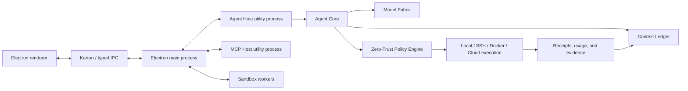

# Developer documentation

This directory describes the current Clodex codebase as a product and as an
engineering platform. It is the starting point for implementation, debugging,
testing, packaging, and operational work.

## Documentation map

| Document                                                                         | Purpose                                                                                                                |
| -------------------------------------------------------------------------------- | ---------------------------------------------------------------------------------------------------------------------- |
| [Architecture](architecture.md)                                                  | Processes, trust boundaries, runtime flow, and state ownership                                                         |
| [Repository map](repository-map.md)                                              | Applications, packages, source roots, and primary entry points                                                         |
| [Local development](local-development.md)                                        | Toolchain, installation, startup, environment variables, and daily workflow                                            |
| [Product capabilities](capabilities.md)                                          | Complete user-facing feature inventory and source ownership                                                            |
| [Agent platform](agent-platform.md)                                              | Agent lifecycle, Context Ledger, model routing, execution, continuity, and generated apps                              |
| [Security and data](security-and-data.md)                                        | Permissions, network policy, protected storage, audit, and privacy invariants                                          |
| [Extensions and integrations](extensions-and-integrations.md)                    | MCP, skills, plugins, runners, providers, and generated-app SDK boundaries                                             |
| [Testing and release](testing-and-release.md)                                    | Test layers, typechecks, packaging, evidence gates, signing, and release channels                                      |
| [Operations and troubleshooting](operations-and-troubleshooting.md)              | Common failures, recovery procedures, logs, and diagnostics                                                            |
| [Status and roadmap](status-and-roadmap.md)                                      | Implemented, gated, operationally pending, and planned work                                                            |
| [Architecture decision records](../adr/README.md)                                | Durable trust-boundary and evidence constraints for contributors                                                       |
| [Hybrid migration](../migration/README.md)                                       | Strangler stages, parity matrix, provenance ledger, and cutover rules                                                  |
| [Architecture boundaries](../architecture/BOUNDARIES.md)                         | Independent, migration, and legacy zones plus dependency and shadow-mode rules                                         |
| [Provenance policy](../governance/PROVENANCE_POLICY.md)                          | Independent implementation, AI assistance, third-party material, and DCO expectations                                  |
| [Open/closed product boundary](../governance/OPEN_CLOSED_BOUNDARY.md)             | Public core/specification, private managed-product, restricted-data, and Gateway-start rules                            |
| [Open/closed component matrix](../provenance/OPEN_CLOSED_COMPONENT_MATRIX.md)     | GREEN/YELLOW/RED provenance and dependency status for extraction and private-boundary candidates                        |
| [Protocol v0 extraction audit](../provenance/PROTOCOL_EXTRACTION_AUDIT.md)        | Clean-room input rules and release gates for a future public protocol/SDK                                                |
| [Protocol v0 input manifest](../provenance/PROTOCOL_V0_INPUT_MANIFEST.json)       | Provisional machine-readable source/AI-context inventory; all gates remain open                                          |
| [Agent Gateway Protocol v0](../protocol/agent-gateway-v0/README.md)               | Schema-only request, approval evidence, signed receipt, error, and version-negotiation draft                            |
| [Product and release plan](../roadmap/PRODUCT_RELEASE_PLAN.md)                    | Gate-based preview, stable IDE, protocol/Gateway alpha, beta, limited availability, and GA targets                      |
| [Security invariants](../security/INVARIANTS.md)                                 | Authority, isolation, credentials, egress, replay, and side-effect constraints                                         |
| [Intent Contract specification](../INTENT_CONTRACT_SPEC.md)                      | Draft signed authority envelope, one-shot execution tickets, effect attestations, and Artifact Bridge security profile |
| [Zero-Trust Execution five-session plan](ZERO_TRUST_EXECUTION_5_SESSION_PLAN.md) | Staged implementation, session boundaries, exit criteria, and promotion rules                                          |
| [Safe Coding Autopilot MVP](SAFE_CODING_AUTOPILOT_MVP.md)                        | Session 5 contracts, Guardian, kernel, runtime, approval, ledger/evidence, scoped adapters, promotion, and blockers    |
| [Security Guarantee Manifest](../security/SECURITY_GUARANTEE_MANIFEST.md)        | Evidence-based status of runtime security claims, blockers, and promotion requirements                                 |
| [Component registry](../provenance/components.yml)                               | Machine-readable component status, ownership, and dependency allowlists                                                |

## Engineering principles

1. **Fail closed.** Missing, stale, malformed, or unauthenticated authority
   must not enable a capability.
2. **Explicit ownership.** The component that owns a state transition also
   owns persistence, validation, and audit for that transition.
3. **Content-free telemetry.** Product telemetry records bounded status and
   counters, never prompts, credentials, command content, file contents, or
   raw network payloads.
4. **Deterministic core, optional model assistance.** Models may classify,
   summarize, or rank, but deterministic policy remains authoritative.
5. **No implicit replay.** A dispatched side effect is never repeated unless
   the protocol supplies an explicit idempotency contract.
6. **Exact-source validation.** Release claims are made from a clean commit,
   not from a mixed working directory.
7. **Feature-gated rollout.** Experimental capabilities remain unavailable or
   default-off until their evidence contract passes.

## High-level runtime

## Source of truth

- Runtime and product behavior: source code and tests.
- Public feature availability: `apps/browser/src/shared/feature-gates.ts`.
- Browser procedures and shared state:
  `apps/browser/src/shared/karton-contracts/ui`.
- Agent contracts and persistence: `packages/agent-core`.
- Release safety: `.github/workflows`, `.release-evidence`, and
  `apps/browser/scripts/check-main-plan-readiness.ts`.
