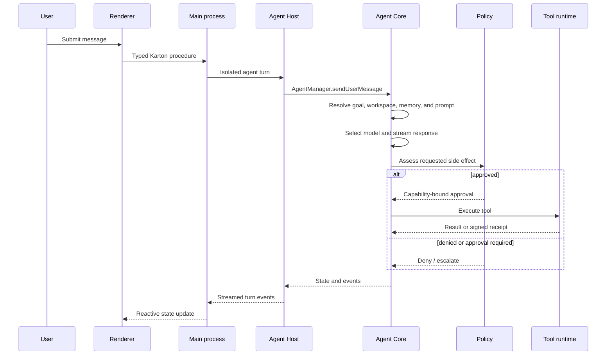

# Architecture

## 1. Process model

Clodex is an Electron application split into isolated runtime lanes.

| Process | Primary responsibility | Main source |
| --- | --- | --- |
| Electron main | Service composition, windows, credentials, file access, policy, IPC | `apps/browser/src/backend/main.ts` |
| Renderer | React UI, routes, chat, settings, review surfaces | `apps/browser/src/ui` |
| UI preload | Narrow renderer-to-main bridge | Vite preload configurations under `apps/browser` |
| Web-content preload | Browser-tab instrumentation and containment | `apps/browser/src/web-content-preload` |
| Agent Host | Supervised agent-step execution outside the main process | `apps/browser/src/backend/agent-host` |
| MCP Host | Supervised MCP transport and OAuth lifecycle | `apps/browser/src/backend/mcp-host` |
| Sandbox worker | Constrained generated-code and tool workloads | `apps/browser/src/backend/services/sandbox` |
| CLI | Headless Agent Core host | `apps/clodex-cli/src/index.ts` |

The main process owns process supervision. Utility-process crashes reject
in-flight work, apply bounded restart policies, and do not replay side effects.

## 2. Application composition

`apps/browser/src/backend/main.ts` constructs backend services and exposes
typed procedures and state through Karton. Major service groups are:

- agent host and Agent Core bridge;
- task, file-tree, terminal, Git, history, and diff services;
- browser window and tab management;
- credentials, data protection, and protected files;
- Context Ledger and Agent OS inspection;
- model providers and Model Fabric;
- MCP, skills, plugins, and marketplace;
- local, SSH, Docker, and cloud execution;
- session continuity and workspace snapshots;
- generated apps and the Artifact Bridge;
- network policy and security audit;
- update, telemetry, and release-channel services.

## 3. Agent turn flow

## 4. State ownership

### Agent Core

Owns agent lifecycle, messages, tool parts, goals, mounts, context assembly,
persistence, Context Ledger, model usage, route decisions, and runner-routing
contracts.

### Browser host

Owns Electron processes, credentials, OS integrations, file-system and Git
adapters, terminal and browser runtimes, UI procedures, provider configuration,
remote profiles, and release-channel feature resolution.

### Extension runtimes

MCP servers, plugins, skills, generated apps, and runners receive explicit
capabilities. They do not receive direct access to arbitrary host services.

## 5. Communication contracts

- **Karton** synchronizes typed browser state and procedures.
- **Agent Host protocol** transports agent turns and host calls.
- **MCP Runtime** normalizes stdio, HTTP, OAuth, resources, prompts, tools, and
  elicitation.
- **Runner contracts** bind jobs to snapshots, leases, capabilities, and
  receipts.
- **Artifact Bridge** uses principal-scoped sessions, grants, quotas, and
  two-phase privileged writes.

## 6. Feature availability

Feature gates are resolved by release channel and optional user overrides.
Definitions live in `apps/browser/src/shared/feature-gates.ts`.

Channels are `dev`, `nightly`, `prerelease`, and `release`. Release
builds must remain safe when promotion evidence is absent. A malformed artifact
fails the readiness gate even when the corresponding feature is default-off.
