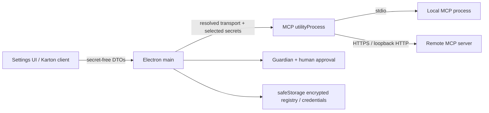

# General MCP Runtime — threat model и разрешения

Дата ревизии: **10 июля 2026**

Этот документ описывает security boundary этапа P0 из
`docs/general-mcp-runtime-plan.md`. Он относится к пользовательским stdio,
Streamable HTTP, legacy SSE и MCP-серверам signed marketplace plugins.
Встроенный Clodex Gateway остаётся отдельным существующим контуром.

## 1. Границы доверия



### Electron main

Доверенная сторона, которая:

- валидирует registry и transport через versioned Zod schemas;
- хранит конфигурацию и custom credentials через strict encrypted
  `safeStorage`;
- разрешает credential references только непосредственно перед подключением;
- проверяет origin binding для remote headers;
- вычисляет effective tool policy;
- вызывает Guardian и human approval до опасного выполнения;
- передаёт renderer только secret-free DTO.

### MCP host

Отдельный Electron `utilityProcess`. Это:

- fault boundary для SDK, network transports и дочерних stdio processes;
- место выполнения MCP protocol operations;
- владелец timeout/cancel и redaction известных secret values;
- процесс, который можно контролируемо перезапустить.

Это **не полноценная OS sandbox**. Компрометация локального MCP-процесса всё
ещё означает выполнение кода с правами текущего OS user.

### Local stdio MCP

Считается недоверенным пользовательским кодом. Он:

- запускается без shell-интерпретации;
- получает явные `command`, `args`, абсолютный `cwd`;
- получает только явно указанные environment values;
- не получает весь environment Electron main;
- не получает credentials, которые пользователь не сопоставил с env key.

### Remote MCP

Считается внешним network principal:

- разрешён HTTPS;
- HTTP разрешён только для loopback;
- credentials в URL и sensitive query parameters запрещены;
- credential header отправляется только origin, разрешённому credential
  metadata;
- redirects не меняют registry origin binding.

### Signed plugin MCP

Подпись подтверждает publisher/package integrity, но не делает tools
безусловно доверенными:

- требуется permission `mcp`;
- remote declaration дополнительно требует `network`;
- credential references требуют `credentials` и объявления в
  `requiredCredentials`;
- stdio executable от plugin запрещён в P0;
- новый plugin server всегда регистрируется disabled;
- publisher `allow-read-only` понижается до `ask`;
- enablement и policy принадлежат пользователю, а не publisher.

## 2. Защищаемые активы

- Clodex session и model credentials;
- пользовательские API keys, PAT, OAuth/session tokens;
- файлы и процессы текущего OS user;
- аргументы tool calls и результаты выполнения;
- integrity MCP registry и plugin declarations;
- стабильность Electron main process;
- privacy logs, Karton state и telemetry.

## 3. Модель пользовательских разрешений

### Добавление и включение сервера

1. Пользователь добавляет server или импортирует preview.
2. Imported и plugin servers создаются disabled.
3. Перед первым подключением пользователь видит:
   - source и trust tier;
   - transport;
   - sanitized command/endpoint;
   - локальный или сетевой execution boundary;
   - default approval policy.
4. Только отдельное действие Enable/Connect активирует server.

### Credentials

- Секрет вводится в password field и после сохранения не отображается.
- Registered credentials используют встроенные field/origin definitions.
- Arbitrary credentials хранятся под namespace `mcp-custom.*`.
- Пустой `allowedOrigins` означает local-stdio-only.
- Для remote credential пользователь явно задаёт HTTPS/loopback origins.
- Один credential reference назначается конкретному env key или HTTP header.
- Secrets в command arguments, sensitive literals и token-shaped literals
  отклоняются.

### Tool policy

Порядок принятия решения:

1. explicit tool `deny`;
2. destructive/irreversible floor → human approval;
3. explicit `ask` или `allow`;
4. server default;
5. source trust;
6. Guardian assessment;
7. human approval, если его требует любой предыдущий слой.

`readOnlyHint` является недоверенным сигналом. Для user/imported servers он
не разрешает auto-run.

## 4. Основные угрозы и меры

| Угроза | Мера |
|---|---|
| Malicious `readOnlyHint` | Custom/imported sources остаются `ask`; destructive hint сильнее explicit allow |
| Secret в JSON registry | Config хранит credential references; sensitive и token-shaped literals запрещены |
| Secret в args | Credential-like stdio arguments отклоняются schema/importer |
| Secret в Karton | UI получает DTO без secret values; command preview и diagnostics санитизируются |
| Secret в logs/errors | Host знает переданные secret values и заменяет их до IPC; main повторно санитизирует diagnostics |
| Secret в telemetry | MCP runtime не отправляет config, args, tool content, endpoint query или credentials в telemetry |
| Shell injection | `StdioClientTransport` получает command/args напрямую; shell не используется |
| Host crash/hang | heartbeat, timeout, cancel, restart backoff, circuit breaker и восстановление desired servers |
| MCP output exhaustion | bounded tool output и capped diagnostic buffers |
| Remote credential exfiltration | exact origin binding; HTTPS outside loopback; credentials in URL запрещены |
| Plugin permission escalation | signed lock entry + `mcp`/`network`/`credentials`; undeclared refs и executables отклоняются |
| Plugin update/uninstall | registry synchronization отключает/удаляет связанные servers немедленно |
| Foreign config live coupling | import — одноразовый read/preview/materialize; watcher и обратная запись отсутствуют |
| Foreign raw tokens | sensitive/token-shaped env/header values удаляются из preview и требуют mapping; secret args делают entry unsupported |
| Registry ID collision | stable validated IDs; import preview получает conflict-free ID; apply повторно проверяет collision |
| Main-process crash от MCP | protocol/SDK выполняются в utility process; invalid IPC открывает controlled failure/restart |

## 5. Persistence

### `mcp-registry.json`

- encrypted `safeStorage` envelope;
- schema version;
- source/transport/policy;
- только literals, прошедшие secret detection, и credential references;
- atomic write через temporary file, `fsync`, rename;
- owner-only file mode.

### `mcp-custom-credentials.json`

- отдельный encrypted `safeStorage` envelope;
- secret values и allowed origins;
- никогда не включается в Karton snapshot;
- custom secret можно удалить независимо от server config;
- отсутствующий reference приводит к fail-closed connection error.

## 6. Lifecycle и диагностика

Публичные states:

- `disabled`;
- `disconnected`;
- `connecting`;
- `connected`;
- `degraded`;
- `failed`.

Registry показывает bounded logs, last sanitized error, connection time и
restart count. Restart восстанавливает только enabled desired servers.

## 7. Safe import

Поддерживается preview совместимой Claude Desktop-конфигурации:

1. файл читается один раз с size limit;
2. JSON и transport валидируются;
3. insecure URLs и unsupported entries отклоняются;
4. raw secrets не входят в preview;
5. command, args, cwd, env/header keys показываются до подтверждения;
6. каждый secret требует явного credential mapping;
7. apply принимает server IDs только из непросроченного backend preview;
8. materialized servers создаются disabled.

## 8. Остаточные риски P0

- Local stdio process имеет доступ уровня OS user и может читать доступные ему
  файлы вне Clodex.
- Process isolation не защищает от kernel/OS-level exploitation.
- Secret detection для arbitrary literals использует denylist и известные
  token signatures; поэтому UI требует использовать credential references для
  любых значений, которые пользователь считает секретными.
- Remote MCP server видит tool arguments, которые пользователь или agent
  отправил после policy/approval.
- OAuth для arbitrary remote MCP, resources/prompts/list-changed и elicitation
  намеренно отложены до P3.

## 9. Проверка

Обязательные команды P0:

```bash
pnpm -F @clodex/mcp-runtime test
pnpm -F @clodex/mcp-runtime build
pnpm -F clodex typecheck
pnpm -F clodex test
pnpm -F clodex smoke:mcp-host
```

`smoke:mcp-host` проверяет реальный built `mcp-host.cjs`, stdio,
Streamable HTTP, SSE, tool call, timeout, cancellation, log redaction,
utility-process crash, restart и восстановление server connections.
