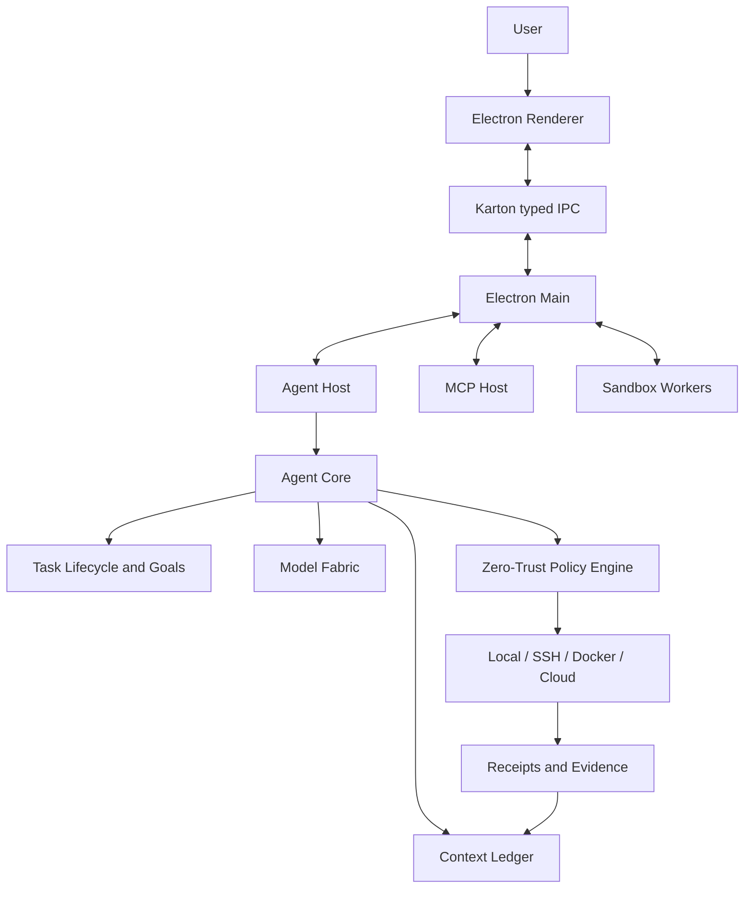

# Clodex — Full Project Documentation

## 1. Purpose

Clodex is an Electron IDE built around an agentic architecture. The application
combines a development interface, AI agents, tools, local and remote execution,
long-term context, extensions, and a security control plane.

This document is intended for developers, technical leads, QA engineers,
DevOps engineers, and support engineers.

## 2. Technology Stack

- TypeScript;
- Electron;
- React;
- Vite;
- pnpm;
- Turbo;
- Vitest;
- Playwright;
- Storybook;
- SQLite;
- Karton;
- MCP;
- Node.js utility processes;
- Docker and SSH adapters.

Deterministic packaging uses Node.js 22.23.1 and pnpm 10.30.3.

## 3. Architecture



Primary processes:

| Process        | Responsibility                                         |
| -------------- | ------------------------------------------------------ |
| Electron Main  | Windows, credentials, filesystem, Git, policy, and IPC |
| Renderer       | React UI, chat, settings, and review interfaces        |
| Agent Host     | Isolated execution of agent turns                      |
| MCP Host       | MCP transports, OAuth, and lifecycle management        |
| Sandbox Worker | Restricted execution of untrusted workloads            |
| CLI            | Headless host for Agent Core                           |

Backend entry point:

`apps/browser/src/backend/main.ts`

## 4. Repository Structure

### Applications

- `apps/browser` — Electron IDE;
- `apps/clodex-cli` — headless Agent Core host;
- `apps/update-server` — update delivery;
- `apps/website` — website;
- `apps/deprecated-cli` — legacy CLI.

### Packages

- `packages/agent-core` — agent runtime;
- `packages/agent-shell` — PTY and terminal support;
- `packages/mcp-runtime` — MCP runtime;
- `packages/karton` — typed RPC and state synchronization;
- `packages/runner-sdk` — custom runner contracts;
- `packages/stage-ui` — UI primitives;
- `packages/nucleo-*` — icons.

## 5. Task Lifecycle

A task is represented by an agent instance and contains:

- an ID;
- an agent type;
- messages;
- a model;
- an approval mode;
- mounts;
- a goal;
- progress;
- runtime status;
- errors;
- persistent metadata.

`AgentManager` is responsible for creation, loading, message dispatch, state
mutations, forking, archiving, persistence, and teardown.

Code:

`packages/agent-core/src/services/agent-manager`

## 6. Goals

A goal contains a description, status, and progress. The extended version also
supports a time budget, token budget, pause and resume behavior, and warnings.

Rules:

- editing a goal must not accidentally reset its progress;
- fork behavior must explicitly define copy and reset semantics;
- the UI must use persisted state;
- hard limits apply only to execution lanes that support them.

## 7. Chat Agent

The system prompt is assembled from:

1. an introduction;
2. behavioral rules;
3. environment adapters;
4. an output contract;
5. authority rules.

Environment adapters provide workspaces, project instructions, skills, memory,
plans, logs, diffs, and shells.

Agent output is divided into a commentary channel and a final response.

## 8. Context Ledger

Code:

`packages/agent-core/src/services/evidence-memory`

Capabilities:

- append-only events;
- claims;
- provenance;
- repository revisions;
- staleness tracking;
- contradiction detection;
- supersession;
- lexical retrieval;
- guarded Context Packs;
- recursive summaries;
- evaluation and dogfood testing.

Truth priority:

1. current workspace state;
2. the latest user decision;
3. a verified tool or test result;
4. an active decision;
5. a model-inferred claim;
6. a historical summary.

Short summaries are produced at approximately ten-minute intervals. Long
summaries recursively compact them at six-hour intervals.

## 9. Memory Notes

Memory Notes support global, workspace, and agent scopes, together with
list, read, search, and delete operations.

Notes are user-manageable records. The Context Ledger is the evidence-based
history of a task.

## 10. Model Fabric

Code:

`packages/agent-core/src/services/model-fabric`

Model Fabric evaluates:

- intent;
- required capabilities;
- context size;
- latency and quality;
- provider health;
- quotas;
- budget;
- release policy.

It supports shadow routing, active routing, fallback, circuit breakers, a usage
ledger, budget events, and signed managed policies.

## 11. Zero-Trust Policy Engine

Code:

`apps/browser/src/backend/services/guardian`

The policy engine receives an action kind, capabilities, scope, target trust,
read-only and irreversible flags, user authorization, and evidence codes.

Its result is `approve`, `escalate`, or `deny`. Deterministic policy remains the
authority. An optional model may operate only in shadow mode.

## 12. Egress Control Gateway

Code:

`apps/browser/src/backend/services/network-policy`

Features:

- deny by default;
- exact destination grants;
- protocol, host, and port matching;
- private-network and loopback protection;
- DNS validation;
- IP-pinned sockets;
- authenticated proxy support;
- controlled browser access;
- MCP proxy fetch;
- audit records;
- Settings UI.

## 13. Shell and Terminal

Code:

- `packages/agent-shell`;
- Browser terminal service;
- Browser toolbox.

The platform supports PTY sessions, commands, cancellation, tabs, logs,
approval modes, and capability-bound authorization.

## 14. Agent Host

Agent Host executes agent turns and isolated steps outside Electron Main.

Its supervisor implements a ready timeout, health checks, bounded restarts,
rejection of pending work, a circuit breaker, and pre-dispatch fallback.

A side effect is never replayed automatically after a crash.

## 15. MCP

Components:

- Browser MCP service;
- MCP Host;
- `packages/mcp-runtime`.

Supported capabilities include stdio, HTTP, OAuth, tools, resources, resource
templates, prompts, elicitation, cancellation, timeouts, and reconnection.

## 16. Files, Git, and Diff

Features:

- paginated file tree;
- file preview;
- protected reads;
- Git status and branches;
- commits;
- pending edits;
- diff history;
- accept and reject operations;
- worktrees.

## 17. Browser Runtime

The Browser Runtime supports tabs, navigation, history, downloads, permissions,
screenshots, selected-element context, automation policies, and managed egress.

Primary code:

`apps/browser/src/backend/services/window-layout`

## 18. Execution

### Local

Agent Shell and a local workspace.

### SSH

Saved profiles, revision verification, workspace materialization, workspace
caching, artifacts, receipts, and cleanup.

### Docker

Digest-pinned images, resource limits, network policy, snapshot archives,
artifacts, and receipt verification.

### Cloud

Bounded requests, snapshots, residency controls, scoped secrets, resume,
cancellation, usage records, and SLO evidence.

## 19. Runner SDK

`packages/runner-sdk` enables custom execution providers.

A runner declares its identity, version, command classes, environment,
cancellation behavior, artifacts, leases, receipts, and security capabilities.

## 20. Session Continuity

Capabilities:

- workspace snapshots;
- Git revision capture;
- dirty-patch identity;
- environment fingerprints;
- checkpoints;
- suspend and resume;
- resumable artifacts;
- leases, epochs, and fencing;
- atomic memory synchronization;
- teleport controls.

## 21. Generated Apps

The Generated App Library supports discovery, metadata validation, preview,
launch, regeneration, safe deletion, package import, and trust evaluation.

Application source belongs to the owner task.

## 22. Artifact Bridge

A generated application is treated as an untrusted principal.

The bridge exposes explicit capabilities:

- read a resource;
- call MCP;
- ask a bounded model question;
- prepare a sensitive operation;
- request approval;
- perform a one-time commit;
- use automations;
- subscribe to lifecycle events.

The application does not receive credentials, filesystem paths, or unrestricted
IPC access.

## 23. Package Trust

The trust layer validates schema, path containment, package identity, publisher
identity, signatures, key fingerprints, revocation status, capabilities, replay
protection, and import limits.

A trust failure blocks execution.

## 24. Plugins and Skills

Skills support global and workspace scopes, metadata, and an enabled state.

Plugins support catalogs, private sources, integrity verification, staged
installation, updates, rollback, capability review, and credential mapping.

## 25. Automations

The platform supports one-time, interval, and cron schedules, retries,
missed-run policies, and local or cloud execution.

## 26. Pull Request Review

The platform supports pull-request detection, metadata, checks, commits, files,
patches, inline comments, approval or change requests, and protected merge.

## 27. Quick Task and Command Center

Quick Task provides a native window, a global shortcut, workspace selection,
and task creation.

Command Center brings together commands, tasks, projects, files, settings, and
actions.

## 28. Dictation and Remote Control

Dictation supports push-to-talk, batch transcription, and an optional real-time
preview.

Remote control uses pairing, device-bound keys, encryption, replay protection,
and attestation.

## 29. Karton

Karton synchronizes typed state, procedures, and subscriptions between the
backend and renderer.

Contracts:

`apps/browser/src/shared/karton-contracts/ui`

## 30. Persistence

Persistence includes the agent database, chat state, attachments, caches, diff
history, Context Ledger, and model-usage records.

Protected files use authenticated encryption and context binding.

## 31. Telemetry

Allowed telemetry includes status, enum values, counts, rates, latency, feature
state, and bounded errors.

Prompts, completions, file contents, commands, credentials, cookies, MCP
payloads, audio, and transcripts are prohibited.

## 32. Feature Gates

Definitions:

`apps/browser/src/shared/feature-gates.ts`

Channels:

- `dev`;
- `nightly`;
- `prerelease`;
- `release`.

An experimental capability remains disabled by default until its promotion is
supported by evidence.

## 33. Local Development

```bash
pnpm install --frozen-lockfile
pnpm build:packages
pnpm --dir apps/browser start:fast
```

Checks:

```bash
pnpm check
pnpm typecheck
pnpm test
```

## 34. Packaging

Local nightly package:

```bash
RELEASE_CHANNEL=nightly CLODEX_ALLOW_UNSIGNED_LOCAL_BUILD=true \
  pnpm --dir apps/browser package
```

Official package:

```bash
pnpm --dir apps/browser make
```

Do not run concurrent builds of the same package in the same worktree.

## 35. Testing

Validation layers:

- Biome;
- TypeScript;
- unit and integration tests;
- utility-process smoke tests;
- visual regression;
- physical SSH, Docker, and hardware smoke tests;
- ASAR and signature validation;
- release-readiness checks.

## 36. Readiness

Normal gate:

```bash
pnpm --dir apps/browser check:main-plan-readiness -- \
  --channel release \
  --require-clean
```

Strict gate:

```bash
pnpm --dir apps/browser check:main-plan-readiness -- \
  --channel prerelease \
  --require-clean \
  --require-promotion all
```

The strict gate remains blocked until real production evidence is available.

## 37. Troubleshooting

### Missing Package Output

```bash
pnpm -F @clodex/agent-runtime-node build
pnpm build:packages
```

### Electron Missing After an `ignore-scripts` Install

Run a normal installation or postinstall, then repeat the test.

### Network Access Is Blocked

Check the feature gate, proxy status, destination grant, and audit reason.

### Readiness Check Failed

Inspect the blockers reported for each capability. Do not bypass the gate.

### Secret Scanner Blocked a Push

Inspect the finding, rotate any real credential, and remove it from reachable
history when necessary.

## 38. Development Rules

1. One capability should be delivered in one atomic commit.
2. Do not reset or clean a shared worktree without coordination.
3. Run release validation in a clean worktree.
4. Every sensitive capability must use a fail-closed policy.
5. Validate all external input against a schema.
6. Keep telemetry free of user content.
7. Never replay a dispatched side effect automatically.
8. Never store private keys in the repository.
9. Define the feature gate and promotion contract before production rollout.
10. Update documentation together with source changes.

## 39. Current Status

The primary IDE, Agent Core, memory, model routing, policy, egress control,
local/SSH/Docker/Cloud contracts, session continuity, generated applications,
extensions, and release-readiness infrastructure are implemented.

Before production release, the project still requires an authoritative
repository, official signing, real-world observations, cross-platform
acceptance, a canary rollout, monitoring, and rollback validation.

## 40. Modular Documentation

- [Developer index](docs/developer/README.md)
- [Architecture](docs/developer/architecture.md)
- [Repository map](docs/developer/repository-map.md)
- [Local development](docs/developer/local-development.md)
- [Capabilities](docs/developer/capabilities.md)
- [Agent platform](docs/developer/agent-platform.md)
- [Security and data](docs/developer/security-and-data.md)
- [Extensions](docs/developer/extensions-and-integrations.md)
- [Testing and release](docs/developer/testing-and-release.md)
- [Operations](docs/developer/operations-and-troubleshooting.md)
- [Status](docs/developer/status-and-roadmap.md)

## 41. Backend Service Catalog

| Service                 | Responsibility                                        |
| ----------------------- | ----------------------------------------------------- |
| `agent-core-bridge`     | Connects the Browser host to Agent Core               |
| `agent-manager`         | UI-facing management of agent instances               |
| `agent-os`              | Shared coordination of policy, memory, and inspectors |
| `artifact-bridge`       | Capability boundary for generated applications        |
| `auth`                  | Login, callbacks, and account state                   |
| `automations`           | Scheduled tasks                                       |
| `credentials`           | Provider and integration credentials                  |
| `data-protection`       | Encryption capabilities                               |
| `docker-runner`         | Docker execution provider                             |
| `file-tree`             | Safe workspace reads and observation                  |
| `generated-app-library` | Generated-application lifecycle                       |
| `git`                   | Git operations and worktrees                          |
| `history`               | Task history and search                               |
| `hosted-pull-request`   | GitHub pull-request review and merge                  |
| `mcp`                   | MCP settings, registry, and host coordination         |
| `network-policy`        | Managed egress                                        |
| `plugin-marketplace`    | Plugin installation and private sources               |
| `protected-files`       | Protected-data views                                  |
| `quick-task-window`     | Native Quick Task window                              |
| `remote-connections`    | SSH profiles and remote execution                     |
| `runner-routing`        | Provider selection and shadow evidence                |
| `sandbox`               | Execution of untrusted workloads                      |
| `session-continuity`    | Snapshots, checkpoints, and teleport                  |
| `telemetry`             | Content-free product telemetry                        |
| `terminal`              | PTY sessions for the UI                               |
| `toolbox`               | Host tool implementations                             |
| `window-layout`         | Electron windows, tabs, and browser views             |

## 42. Data Lifecycle

### Task Creation

1. The Renderer calls a typed procedure.
2. `AgentManager` creates an instance.
3. The agent database persists its metadata.
4. `MountManager` attaches the workspaces.
5. The UI receives reactive state.

### User Message

1. The message is validated.
2. It is stored in agent state.
3. The Context Ledger receives a material event.
4. The agent turn is sent to Agent Host.
5. Streaming output updates state.
6. Persistence stores the completed turn.

### Tool Call

1. The agent selects a tool.
2. The host creates a capability context.
3. Policy evaluates the action.
4. The tool runs or waits for approval.
5. The result is returned to the agent.
6. A content-free receipt is stored in audit and evidence records.

### Shutdown

1. The application stops accepting new turns.
2. Pending state is flushed atomically.
3. Utility processes terminate.
4. PTY sessions close.
5. Data services perform teardown.

## 43. Environment Variables

Primary template:

`.env.example`

### Product Endpoints

- `CLODEX_ORIGIN`;
- `CLODEX_LOGIN_URL`;
- `CLODEX_API_URL`;
- `CLODEX_LLM_RELAY_URL`;
- `CLODEX_CONSOLE_URL`;
- `UPDATE_SERVER_ORIGIN`.

### Runtime Controls

- `CLODEX_DISABLE_ISOLATED_AGENT_RUNTIME`;
- `CLODEX_CLOUD_TASKS_KILL_SWITCH`;
- `CLODEX_CLOUD_TASKS_URL`;
- `CLODEX_CLOUD_TASKS_RESIDENCY`;
- `CLODEX_BROWSER_EGRESS_ALLOWED_HOSTS`;
- `CLODEX_DOCKER_RUNNER_IMAGE`.

### Packaging

- `RELEASE_CHANNEL`;
- `APP_VERSION_OVERRIDE`;
- `CLODEX_BUILD_COMMIT_SHA`;
- `CLODEX_ALLOW_UNSIGNED_LOCAL_BUILD`.

### Signing

- `APPLE_ID`;
- `APPLE_PASSWORD`;
- `APPLE_TEAM_ID`;
- Windows signing variables;
- promotion-authority keys.

Never print private values in logs or place them in documentation.

## 44. UI Map

### Main Interface

- task sidebar;
- agent chat;
- composer;
- file tree;
- terminal;
- browser;
- pending edits;
- status cards;
- Command Center.

### Routes

- projects;
- diff review;
- pull request;
- generated applications;
- preview pages;
- plugins;
- skills;
- settings;
- Quick Task.

### Settings

- General;
- Account;
- Models and Providers;
- Custom Providers;
- Memory;
- Agent OS;
- Browsing;
- Website Permissions;
- Worktrees;
- MCP and Cloud;
- Remote Connections;
- Skills and Plugins;
- Network Egress;
- About and Updates;
- Clear Data.

Every Settings feature must support loading, empty, error, disabled, and
success states.

## 45. Adding a New Tool

1. Define typed input and output.
2. Implement the tool in a provider-neutral or host layer.
3. Define approval semantics.
4. Add capability context.
5. Restrict paths, arguments, and output.
6. Add timeout and cancellation behavior.
7. Add negative tests.
8. Add a UI tool card when needed.
9. Verify telemetry behavior.
10. Update the documentation.

A tool must not read credentials directly or expand its own permissions.

## 46. Adding a Model Provider

A provider must implement:

- model discovery;
- authentication;
- streaming;
- structured output;
- token limits;
- normalized errors;
- health reporting;
- quota signals;
- cancellation.

After connecting it:

1. add provider settings;
2. add model-catalog mapping;
3. add API-key validation;
4. add Model Fabric capabilities;
5. add tests;
6. verify fallback behavior.

## 47. Failure Semantics

### Before Dispatch

Fallback to a compatible runtime or provider is allowed.

### After Dispatch

Do not automatically retry a side effect. Return the error to the caller. A
retry is allowed only through an explicit idempotency contract.

### Invalid Evidence

Promotion and sensitive actions are blocked.

### Missing Optional Subsystem

The primary task should continue without an optional subsystem when the
capability is not required. For example, an unavailable model summarizer must
not disable the Context Ledger.

### Corrupted Protected Data

Do not overwrite it automatically. Return a bounded error and offer diagnostics
or an explicit reset.

## 48. QA Acceptance Checklist

### Task

- create;
- restart recovery;
- fork;
- archive and unarchive;
- goal persistence;
- follow-up queue;
- cancellation.

### Files

- large directory;
- binary preview;
- symlink and path traversal;
- concurrent update;
- diff accept and reject.

### Terminal

- create a session;
- execute a command;
- cancel;
- resize;
- restart;
- protected logs.

### Browser

- navigation;
- permissions;
- network denial;
- temporary grant;
- revoke;
- download;
- screenshot.

### Models

- provider login;
- custom endpoint;
- model switching;
- quota error;
- fallback;
- cancellation.

### Memory

- long-running task;
- restart;
- stale fact;
- contradiction;
- repository revision change.

### Remote Execution

- SSH success and failure;
- Docker unavailable;
- artifact mismatch;
- cancellation;
- stale lease.

### Generated Apps

- preview;
- capability request;
- denied write;
- approved one-time commit;
- package revocation.

## 49. Production Checklist

1. Clean exact source.
2. Full formatting, type checking, and tests.
3. Secret scan.
4. Release-readiness check.
5. Package build.
6. ASAR and fuse verification.
7. Signing.
8. Notarization.
9. Installer checksum.
10. Clean-profile smoke test.
11. Manual acceptance.
12. Promotion evidence.
13. Canary rollout.
14. Monitoring.
15. Rollback validation.

## Related Documentation

- [Product overview in English](short_doc.en.md)
- [Full documentation in Russian](full_doc.md)
- [Developer documentation index](docs/developer/README.md)
